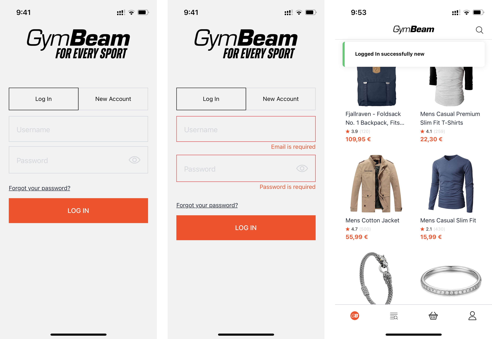
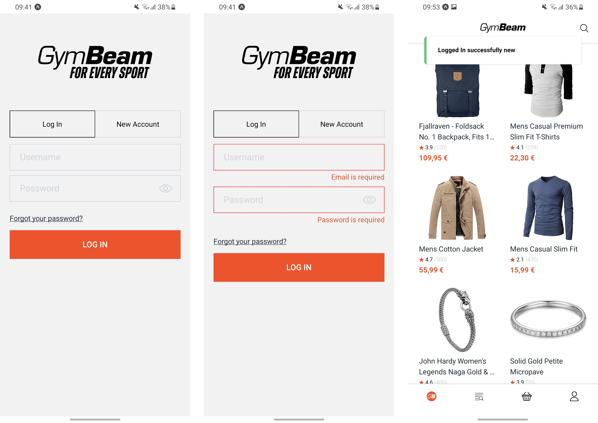
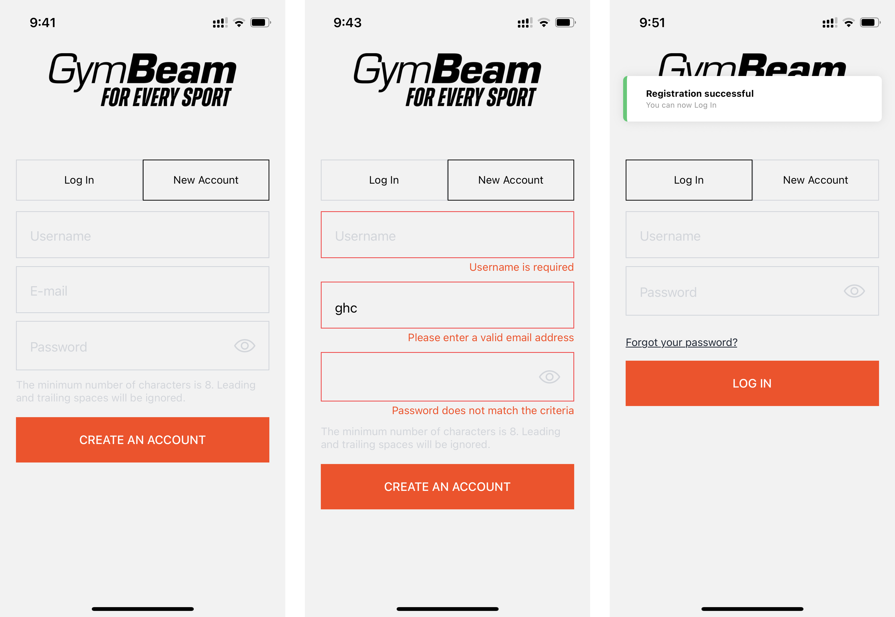
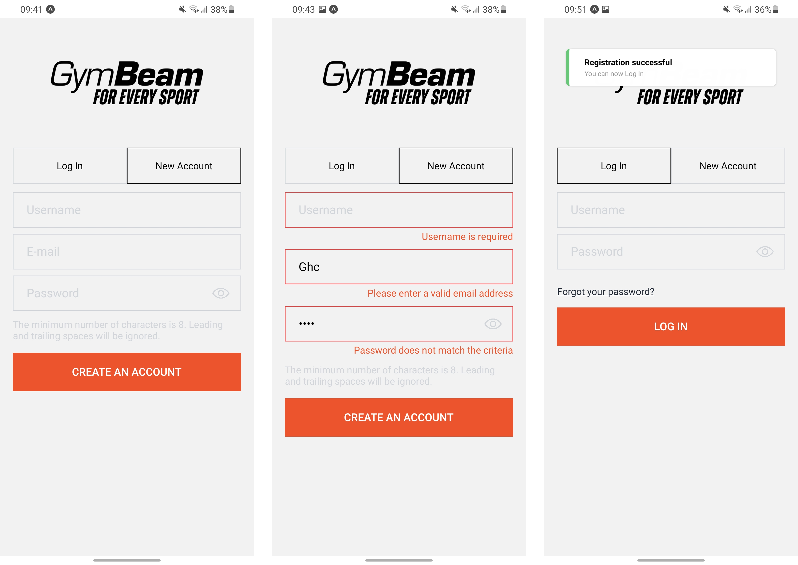
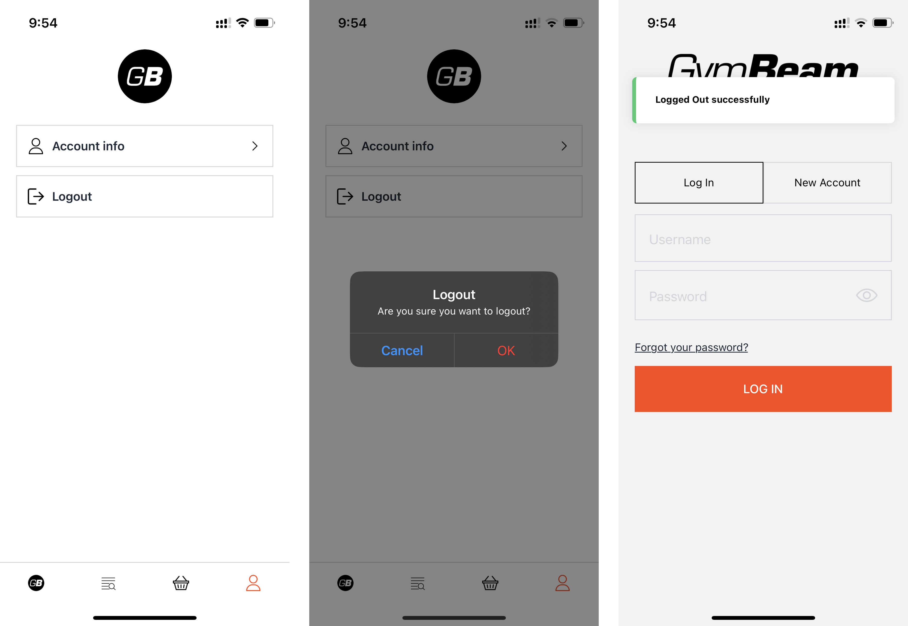
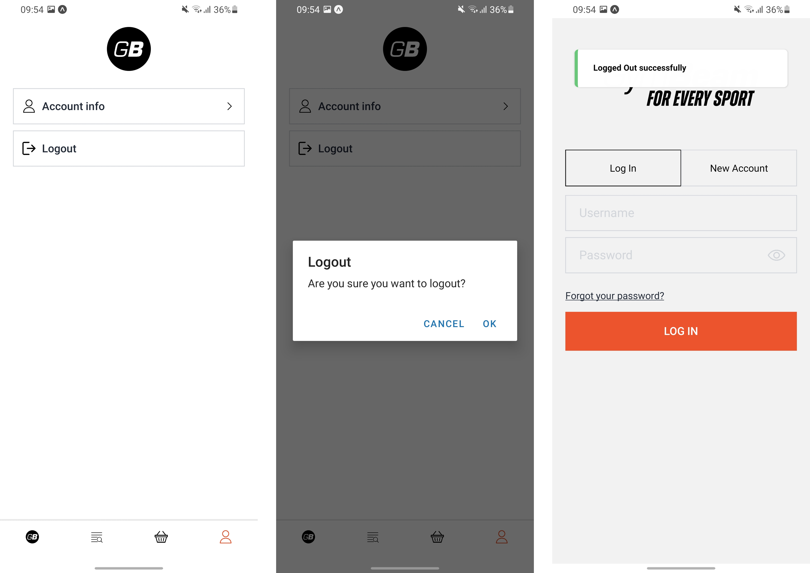

# GymBeam - Fake Store App (React Native)

This is a mobile e-commerce application for GymBeam, built with React Native (Expo) and TypeScript.  
The app allows users to browse products, view product details, and handle authentication.

**Project repository:**  
https://github.com/RisoPodol/gb_rn_store_app.git

---

## Installation & Running

1. **Clone the repository**

   ```sh
   git clone https://github.com/RisoPodol/gb_rn_store_app.git
   cd gb_rn_store_app
   ```

2. **Install dependencies**

   ```sh
   npm install
   ```

3. **Start the app**
   ```sh
   npx expo start
   ```
   - You can run the app on an emulator or a physical device using Expo Go.

---

## Project Overview

### API

> **Note:**  
> This project uses [Fake Store API](https://fakestoreapi.com/) as a mock backend for products, authentication, and user data.  
> All API requests are sent to this public API for demonstration and development purposes.

### Folder Structure

```
gb_rn_store_app/
├── app/
│   ├── (root)/
│   │   ├── (tabs)/                # Main tab navigation screens
│   │   │   ├── cart.tsx           # Cart screen
│   │   │   ├── explore.tsx        # Explore/browse screen
│   │   │   ├── index.tsx          # Home/product list screen
│   │   │   └── profile.tsx        # User profile/settings screen
│   │   └── products/              # Product detail screen
│   │       └── [id].tsx
│   ├── log-in.tsx                 # Login and registration screen
│   └── global.css                 # Tailwind CSS setup
├── assets/                        # Static assets (icons, images)
│   ├── icons/
│   └── images/
├── components/                    # Reusable UI components
│   ├── BottomScreenButton.tsx
│   ├── Card.tsx
│   ├── Collapsible.tsx
│   ├── Error.tsx
│   ├── InputField.tsx
│   ├── SettingsItem.tsx
│   ├── Shimmer.tsx
│   ├── ShimmerCard.tsx
│   ├── ShimmerProductDetail.tsx
│   └── TabIcon.tsx
├── constants/                     # Static data, icons, and images
│   ├── data.ts
│   ├── icons.ts
│   └── images.ts
├── lib/                           # API logic and global context
│   ├── api.ts                     # API client and backend calls (login, register, products...)
│   ├── global-provider.tsx        # Global context provider (auth state, user info)
│   └── useApi.ts                  # Custom hook for data fetching (loading, error, data, refetch)
├── types/                         # TypeScript types and interfaces
│   ├── Product.ts
│   └── index.ts
├── utils/                         # Utility functions and helpers
│   ├── alerts.ts
│   └── toasts.ts
├── .env.local                     # (Optional) Environment variables for testing credentials
├── tailwind.config.js             # Tailwind CSS config for NativeWind
├── babel.config.js                # Babel config
├── metro.config.js                # Metro bundler config
├── tsconfig.json                  # TypeScript config
├── package.json
└── README.md
```

---

## Authentication & User State

- **User authentication state** is managed via a global context (`lib/global-provider.tsx`), which tracks if the user is logged in (`isLoggedIn`).
- On login, a token is stored in SecureStore; on logout, it is removed.
- The app checks for a token on startup to determine authentication state and redirects to `/log-in` if not authenticated.
- The login and registration logic is in `app/log-in.tsx`.

---

## API Communication

- All API calls are handled in `lib/api.ts` using Axios.
- The API client is preconfigured with base URL, headers, and timeout.
- Authentication tokens are stored securely and attached to requests as needed (see commented interceptor in `api.ts`).
- Data fetching throughout the app is abstracted via the `useApi` custom hook, which manages loading, error, and data states.
- **All backend data is provided by [Fake Store API](https://fakestoreapi.com/).**

---

## UI & Navigation

- The app uses Expo Router for navigation and file-based routing.
- Product lists and details are rendered using FlatList and ScrollView.
- Loading states are handled with custom shimmer components for a smooth UX.
- Errors are displayed using a reusable `Error` component.
- The bottom action button (e.g., "Add to cart") is absolutely positioned and always visible on product detail screens.
- Styling is handled using [NativeWind](https://www.nativewind.dev/) (Tailwind CSS for React Native).

---

## 📸 Screenshots

### Log In
>iOS



>Android



---

### Registration
>iOS



>Android



---

### Home Product list
>iOS


>Android


---

### Product detail
>iOS


>Android


---

### Profile / Log Out
>iOS



>Android



---
